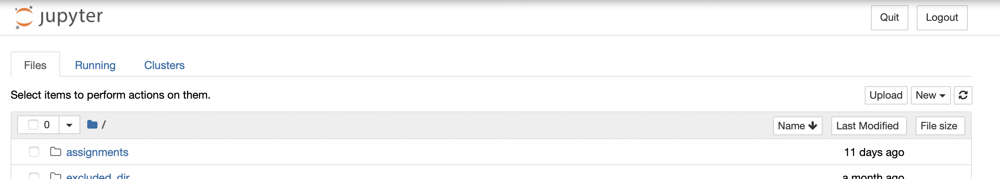

# A clean Python installation using `conda`
_(as of May 2023)_

It is finally the moment to move from the safe harbours of Google Colab into the perilous waters of local Python installations! 

For now follow the instructions below - but don't be scared, it will all make sense in the end!

**Note:** a _local Python installation_ means a Python interpreter running Python instructions on the CPU of your computer (this is different from running Python instructions on a remote server, which is what we have been doing with Google Colab)

## Before you start
Do you actually need a new Python installation? Pick the option that best describes you:

- _I have never used Python on my computer before_: you need a new Python installation. Continue to `Python installation`
- _I remember doing something with this Python thing a while ago on my computer, but I don't remember what._
    We'll need more information:
  - _I installed Anaconda a while back_: you probably want to uninstall it and start from scratch. To uninstall it, follow the instructions [here](https://docs.anaconda.com/anaconda/install/uninstall/). 
  - _I used Python to run some important code which I might need again_: Contact me, we'll figure out what to do to keep your stuff running.
  - _I installed Python but not through Anaconda_: contact me, we'll figure out what to do to remove it
  
- _I have a Python installation on my computer, and I know the basics of how to run it locally_: you can skip this installation. Just make sure you have the following packages installed for now:
  - `numpy`
  - `scipy`
  - `matplotlib`
  - `pandas`
  - `scikit-learn`
  
  And that you can run Jupyter notebooks.

---

##  Python installation
We will be managing our local Python installation using `conda`. `conda` is a package manager, which means it is a program that will help you install and update Python and its libraries. It is also a virtual environment manager, which means it will help you create and manage different Python environments - more on this in the next lectures!

### 0. Download and install `conda`
Go [here](https://docs.conda.io/en/latest/miniconda.html) and dowload the latest installer for your operating system.


After the download, run the installer and follow the instructions. The only option I recommend checking and eventually changing is the installation path. I recommend installing `conda` in your home directory, so that it is easy to find and manage. Make sure it is directly under  `/Users/your-username/` (Mac) or `C:\Users\your-username\` (Windows).

#### Test your `conda` installation
Open a terminal (Mac; you can search it with the OS search) or an Anaconda prompt (Windows; you can search it with the OS search) and type `conda`. If you see a list of commands, you are good to go! If you get something like `conda: command not found`, ask for help!

---
### 1. Install jupyter
We will be using Jupyter notebooks to write and run our code. To install it, type the following command in the terminal:

```bash
conda install jupyter
```

This will install Jupyter and all the packages it needs to run. If you are asked to confirm the installation, type `y` and press enter. It can take a bit!

#### Test your Jupyter installation
Type the following command in the terminal:

```bash
jupyter notebook
```
You should see a browser opening with a Jupyter notebook. If you do, you are good to go! If you get something like `jupyter: command not found`, ask for help!


---
### 2. Create a new Python environment
We will now create a new Python environment. This is a good practice to keep your Python installations clean and tidy.

From the terminal you opened for testing, write the following command:

```bash
conda create -n course-env python=3.9
```

This will create a new Python environment called `course-env` and install Python 3.9 in it. 

#### Test your new environment
To activate your new environment, and check that it is working, type the following commands:

```bash
conda activate course-env
python --version
```

This should print `Python 3.9.something`. If it doesn't, ask for help!

---

### 3. Install the packages we need
We will now install the packages we need for the course. In the terminal you opened for testing, copy the following commands:

```bash
conda install numpy scipy matplotlib pandas scikit-learn scikit-image ipykernel
ipython kernel install --name=course-env
```

#### Test your packages
Close and reopen the terminal (or command prompt), then type the following command:

```bash 
juptyer notebook
```

This should open a browser with a Jupyter notebook, something that looks like this:




Click on the `New` menu and check that you see `course-env` in the list of available kernels:


Select `course-env` and create a new notebook. In the first cell, type the following code:

```python
import numpy as np
import matplotlib.pyplot as plt

plt.plot(np.random.randn(100))
```


